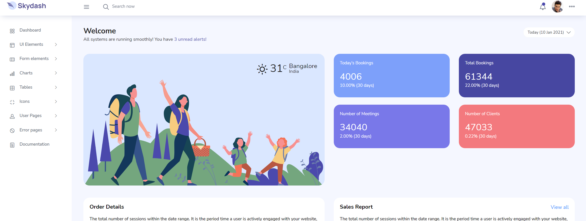

### Instalation
```
git clone: https://github.com/imamprayudi/gitwebapi.git
```

### composer install
```
composer install
```

### copy .env
```
cp .env.example
```

### generate keys
```
php artisan key:generate
```

### run projects
```
php artisan serve
```

**Preview dashboard**

